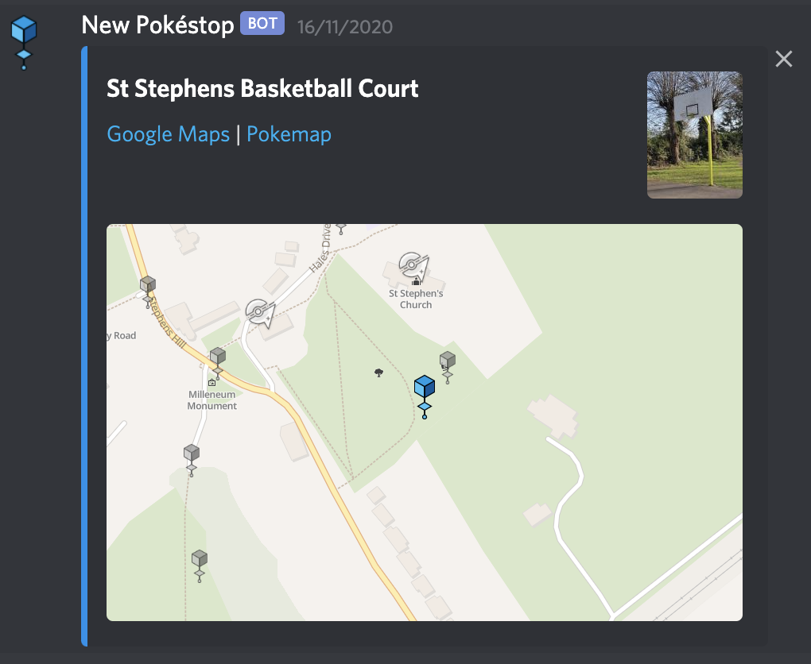
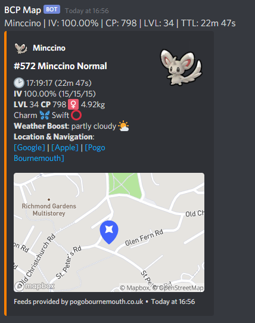

# Facebook
(This feature is coming soon and currently being tested)
Over facebook messenger there are two notification groups.  You need to ask to be invited and a member of the mapping service.  Best to ask on the discord.

The two groups are:

## Hundos
(This feature is coming soon and currently being tested)
This shows 100% IV Pokemon found by the map for the entire Bournemouth area.  If you only want to see a small section of these notifications, see custom notifications

## Community day, High IV
(This feature is coming soon and currently being tested)
A special alert channel runs on community days.  This shows Pokemon with an IV of 96%.  These notifications don't show the pokemon map tile, but rather include a link to google maps taking you straight to the pokemon.

# Discord

The discord is open access and can be joined by following the invite link.

There are four discord channels; notifications in these channels are much richer than the Facebook equivelants as Discord allows for higher-fidelity formatting. Most of the notifications contain a link to google maps or the BCP Pokemon map to be able to identify exactly where the target is.

## Pokestop change notifications
(Coming soon)
The `#new-changed-pokestops` shows changes to pokestops in the local area

## Interesting quests
The `#mapped-quests` currently shows spinda, but in general will track meta-important quests such as gibles, rare shinies etc.

## Hundos and Nundos

The `#hundos` channel shows both hundos (100% IV) and  `#nundos` will show nundo (0%) IV pokemon in the local area

## High IV Community Day

The `#mapping-community-day` channel is activated on community day, and generally shows pokemon with IV of 96%+ in the city centre area

# Want something different?

Have a look at using the bot to send you customised notifications